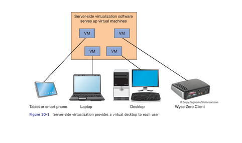
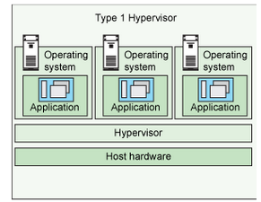
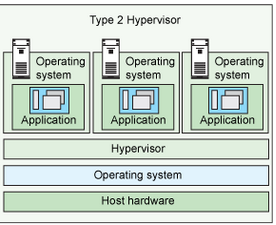
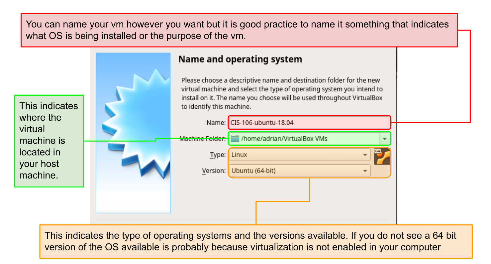
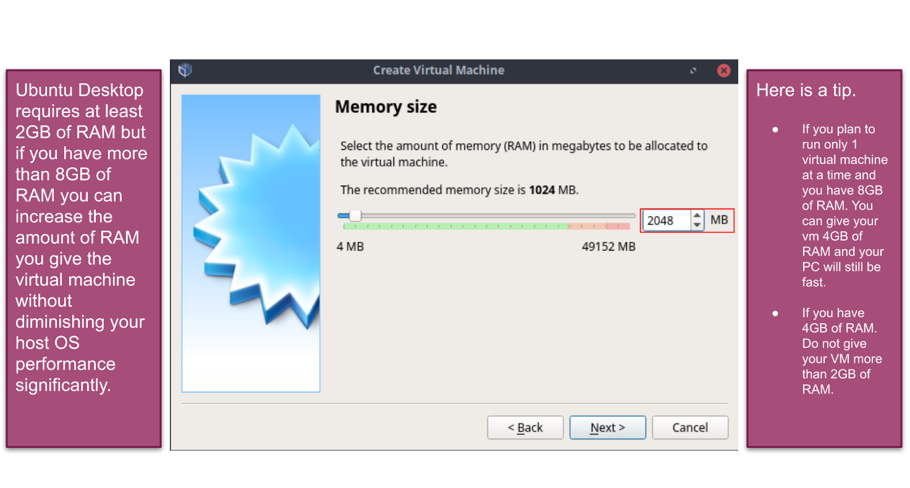
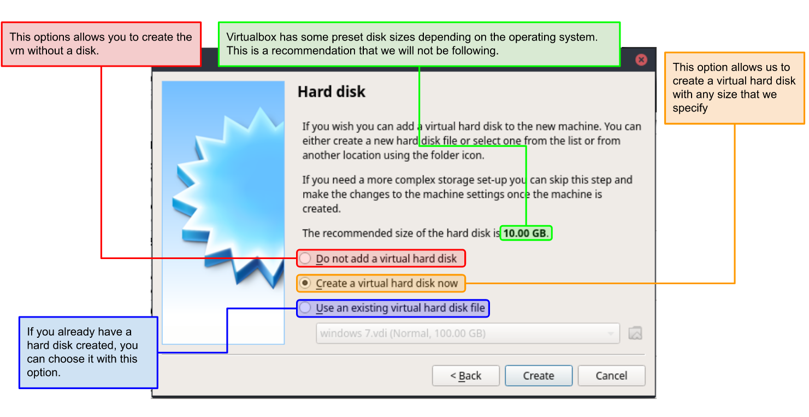
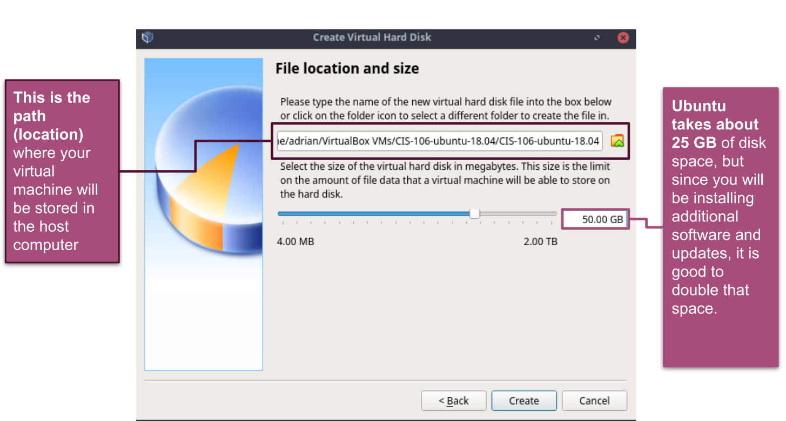
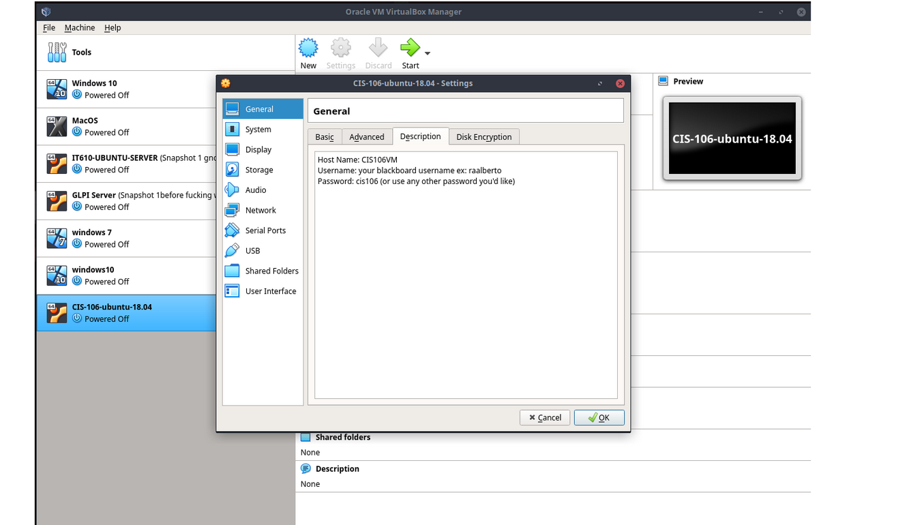
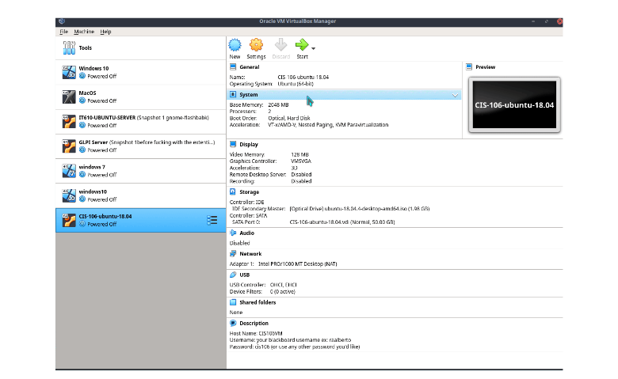

# Week Report 2

## Basics of virtualization

1. **What is virtualization**

Virtualization is a replication of hardware to stimulate a virtual machine inside a physical machine.

2. **Types of virtualization**

The two general types of virtualization are server-side virtualization and client-side virtualization. The difference between the two is **where the virtualization takes place.** 

Server side virtualization is provides a virtual desktop to each user. It has a virtual desktop infrastructure (VDI). This type runs on hardware such as VMware ESX and ESXi Citrix XenServer.

Client side virtualization is software installed on a computer to manage virtual machines. Each VM has its own operating system installed. The computer needs a hypervisor (software that allows the management of virtual machines) and hardware support (capable CPU, enough ram, enough storage). Some examples of the host operating system it runs on are VMware Workstation Player/Pro Oracle VirtualBox.
 

## Installing Ubuntu in Virtualization

