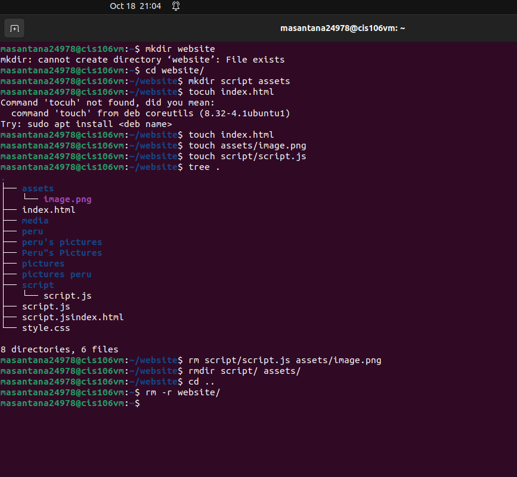
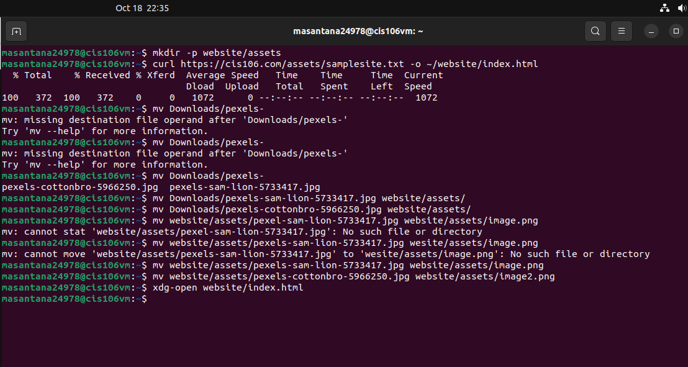
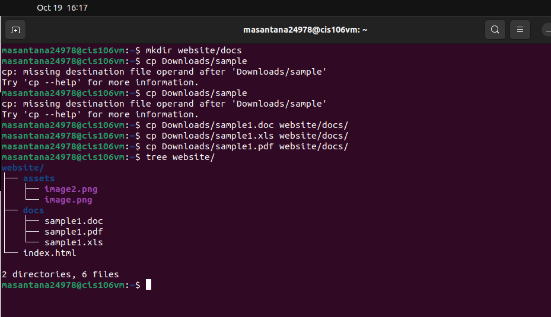

# Week Report 5

### 1. Answer the following:

* What are Command Options?
  
Command Options are options that follow commands that modify/enhance their behavior.

* What are Command Arguments?
  
Command Arguments are arguments which are the items open which the command acts on. It follows a command. 
    
 * Which command is used for creating directories? Provide at least 3 examples.
  
The command for creating directories is mkdir. To create a directory use this formula: mkdir + the name of the directory.Three examples are:

    1. mkdir wallpapers/'cities usa': creates a directory with a space in the name
        
    2. mkdir wallpapers/"majora's mask": creates a directory with a single quote in the name
        
    3. mkdir wallpapers/cars wallpapers/cities wallpapers/forest: creates multiple directories

* What does the touch command do? Provide at least 3 examples.
  
The touch command is used for creating files. Three examples are:

    1. touch list: to create a file called list
   
    2. touch list_of_cars.txt script.py names.csv: to create several files
   
    3. touch "list of foods.txt": to create a file with a space in its name
  
* How do you remove a file? Provide an example.

To remove files use the rm command. Some example are:

    1. rm -i list: removes file and prompt confirmation before removal
       
    2. rm -I Downloads/games/*: removes all the files inside a directory and asks before removing more than 3 files
        
    3. rm list: removes a file 

* How do you remove a directory and can you remove non-empty directories in Linux? Provide an example.
   
The rm by default does not remove directories. To remove a directory use **rm -r** option. In Linux and other Nix systems you cannot remove non empty directories. To remove empty directories use the **rmdir** command. To remove non-empty directories use **rm + directory name ir directory absolute path**. Examples are: 

    1. rmdir Downloads/games: remove an empty directory

    2. rm -r Downloads/games: remove a non empty directory

* Explain the mv and cp command. Provide at least 2 examples of each.

The mv command moves and renames directories. The formula for the command is **mv + source + destination**. For renaming files/directories the formula is **mv + file/directory + new name**. The cp command copies files/ directories from a source to a destination. The structure used is the same as the mv command: **cp + files to copy + destination**. To copy directories you must use the -r option: **cp -r + directory to copy + destination**. Examples of mv:

    1. mv Downloads/homework.pdf Documents/: moves file from a directory to another using relative path
           
    2. sudo mv ~/Downloads/theme usr/share/themes: moves a directory from one directory to another using absolute path 
        
    3. mv Downloads/english_homework.docx /media/student/flashdrive/: moves a file from one directory to another combining absolute path and relative path
    
    4. mv games/ wallpapers/ rockmusic/ /media/student/flashdrive/: moves multiple directories/files to a different directory
        
    5. mv ~/Downloads/homework.docx ~/Downloads/cis106homework/.docx: renames a file using absolute path 
        
    6. mv Downloads/cis106homework.docx Documents/new_cis106homework.docx: moves and renames a file in the same command

Examples of cp:

    1. cp Downloads/wallpapers.zip Pictures/: to copy a file
   
    2. cp -r ~/Downloads/wallpapers ~/Pictures/: copies directory with absolute path

    3. cp Downloads/wallpapers ~/Pictures/: copies the content of a directory to another directory

    4. sudo cp -r script.sh program.py home.html assets/ /var/www.html/: copies multiple files in a single command
  
 ### 2. Complete all practices
   
Practice 1: 

Practice 2:

Practice 3:

Practice 4:

  
   