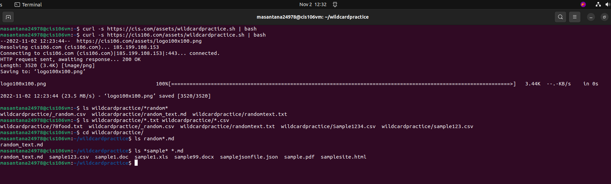
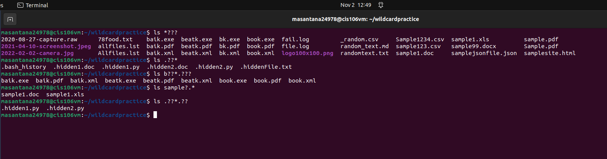
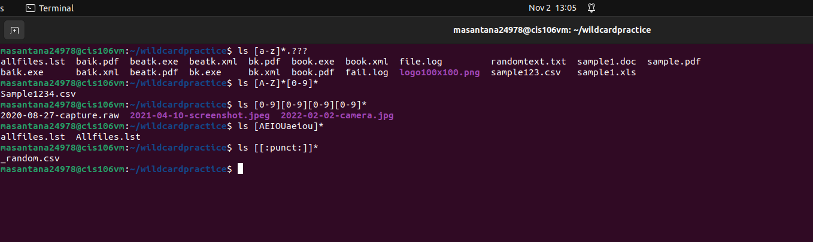

# Week Report 6

## Wildcards:
Represents letters and characters used to specify a file name for searches

## * Wildcards
The main wildcard is a star or asterisk. A star alone matches anything and nothing and matches and number of characters. 

**Examples:**
List all the text files in a directory:
      
       ls *.txt
List all the files that start with the word file:

     ls file*
  Copy all the mp4 files:
  
      cp Downloads/*.mp4 ~/Videos/Movies/

## ? Wildcards:
Matches one character and very useful hen working with hidden files.

**Examples:**
  List all hidden files in the current directory:
      
       ls ./.??*
  List all files that have a two character between letter b and k:
      
       ls b??k*
  List all the files that have a 3 letter file extension:

       ls *.??

## [] Wildcards:
Match a single character in a range and use the exclamation mark to reverse the match.

**Examples:**
List all files that have a vowel after letter f:

    ls f[aeiou]*
List all files whose name begins with a letter from a-p or start with letter s or c:

    ls [a-psc]*
List all files whose name begins with any 3 combinations of numbers and the current user's username:
    
    ls [0-9][0-9]$USER

## Brace Expansion:
Not a wildcard but another feature of bash that allows you to generate arbitrary strings to use with commands

**Examples:**
To create a whole directory structure in a single command:

    mkdir -p music/{jazz,rock}/{mp3files,videos,oggfiles}/new{1..3}
To create a N number of files use:
    
    touch website{1..5}.html
    touch file{001.10}.py
    touch file{{a..z},{0..10}}.js
Remove multiple files in a single directory:
    
    rm -r {dir1,dir2,dir3,file.txt,file.py}
  
  # Practice
**Practice 5**

**Practice 6**

**Practice 7**
